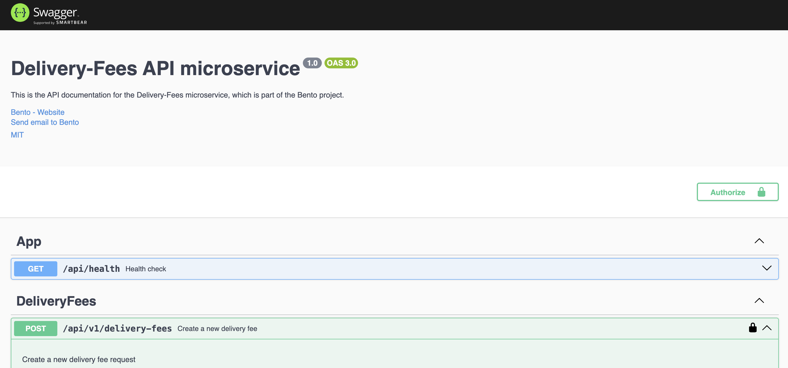

<p align="center">
  <a href="https://bento.ky//" target="blank"></a>
</p>

  <p align="center">Bento Fees Microservice.</p>
    <p align="center">
<a href="https://www.npmjs.com/~nestjscore" target="_blank"></a>
<a href="https://www.npmjs.com/~nestjscore" target="_blank"></a>
<a href="https://www.npmjs.com/~nestjscore" target="_blank"></a>
<a href="https://circleci.com/gh/nestjs/nest" target="_blank"></a>
<a href="https://discord.gg/G7Qnnhy" target="_blank"></a>
<a href="https://opencollective.com/nest#backer" target="_blank"></a>
<a href="https://opencollective.com/nest#sponsor" target="_blank"></a>
  <a href="https://paypal.me/kamilmysliwiec" target="_blank"></a>
    <a href="https://opencollective.com/nest#sponsor"  target="_blank"></a>
  <a href="https://twitter.com/nestframework" target="_blank"></a>
</p>
  <!--[](https://opencollective.com/nest#backer)
  [](https://opencollective.com/nest#sponsor)-->

## Description

This microservice is responsible for integrating with Bento.ky to receive delivery fees and apply a new margin value to calculate a new fee. All requests are saved in the database, allowing users to query and consult all calculations.

## Project Setup

1. **Install the dependencies**

```bash
$ yarn install
```

2. **Create and configure the environment variables**

```bash
$ cp .env.template .env
```

> Ensure the variables _BENTO_IDENTITY_HOST_ and _BENTO_IDENTITY_API_KEY_ are set according to your **Google Identity Toolkit API** configuration.

3. **Start the dependency services (PostgreSQL on default port 5432)**

```bash
$ docker compose up -d
```

4. **Create necessary tables using migration scripts**

```bash
$ npm run migration:run
```

5. **Verify the service is running correctly**

```bash
$ curl -X 'GET' 'http://localhost:3001/api/health' -H 'accept: application/json'
```

> You should receive the response `{"status":"ok"}` with a status code of 200.

## Compile and run the project

```bash
# development
$ yarn run start

# watch mode
$ yarn run start:dev

# production mode
$ yarn run start:prod
```

## Run tests

```bash
# unit tests
$ yarn run test

# e2e tests
$ yarn run test:e2e

# test coverage
$ yarn run test:cov
```

## Accessing the Documentation (Swagger)

You can view the documentation at the [Swagger link](http://localhost:3001/docs). Each endpoint has its body and response specification documented. Some endpoints are public and can be accessed without any authentication, while others require authentication. Instructions for obtaining a token are provided in the section below.

<p align="center"></p>

### Authentication (Private Endpoints)

The system uses bearer token authentication, signed and validated by the Bento.ky service. To obtain a token, follow these steps:

> First, you need an account on the Bento.ky website. Follow the ["Create account"](https://bento.ky/register?return=profile) process.

1. Log in to the Bento.ky website. Open the **Developer Tools** and inspect the network. Look for calls to `https://api.bento.ky/`. Each call will have a **Bearer token** in the request headers under the _authorization_ name.

   1.1. If you cannot find calls to `https://api.bento.ky/`, you can get the **Bearer token** from the application cookies under the _token_ name.
   <p align="center"></p>

2. You can also obtain a Bearer token by using the `http://localhost:3001/api/v1/auth/login` endpoint (see the [Swagger documentation](http://localhost:3001/docs#/Auth/AuthController_signIn)). Simply fill in the username and password that you registered on the Bento.ky website. Ensure the variables BENTO_IDENTITY_HOST and BENTO_IDENTITY_API_KEY are set according to your Google Identity Toolkit API configuration.

   ```bash
   curl -X 'POST' \
     'http://localhost:3001/api/v1/auth/login' \
     -H 'accept: application/json' \
     -H 'Content-Type: application/json' \
     -d '{
     "username": "john_doe",
     "password": "password123"
   }'
   ```

## License

Nest is [MIT licensed](https://github.com/nestjs/nest/blob/master/LICENSE).
